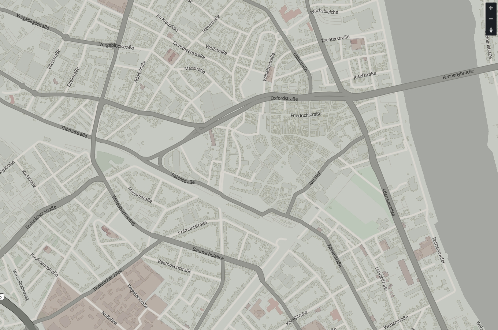
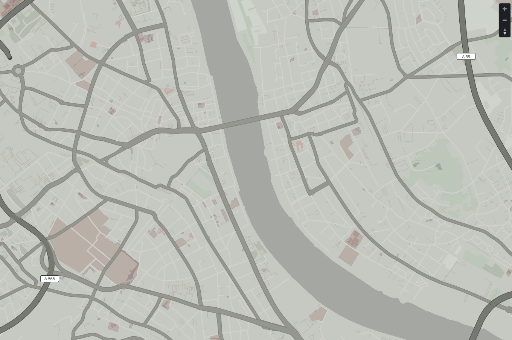

# Mobility
A sample style for use with Maputnik

- [View the style as an OpenLayers map in the browser](http://htmlpreview.github.io/?https://github.com/PetersonGIS/Mobility/blob/master/live-map.html) (note that text and tilt are not currently functioning)
- This style makes use of road casing and road shields
- Intended for use as a light basemap
- Clipping issues at zoom 15 & higher to be fixed soon
- The bonn_lakes data layer is missing a few pieces of the Rhine River
- If Maputnik doesn't recenter for you, try #11.5/50.7377/7.1119

