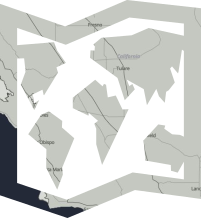

# Mobility 
This is a map style that uses a publically available [Tegola](https://github.com/terranodo/tegola) tileset of the world. It is currently still under development.

## Viewing the map in the browser
- [Rendered with OpenLayers:](http://htmlpreview.github.io/?https://github.com/PetersonGIS/Mobility/blob/master/live-map.html)
Note that the road labels and tilt functionality are missing from this map, which displays the mobility.json style.
- [Rendered with Mapbox:](http://www.gretchenpeterson.com/live-map-mapbox-mobility.html) 
  Note that road labels and tilt are working in this map, which displays the mobility3d.json style. Test the tilt (pitch)   functionality by holding ctrl while clicking and dragging. The building extrusions are not yet functional on mobile devices.

## Map Design

The mobility basemap has a subdued color scheme to accomodate data overlays and is in the same style family as other light basemaps. Use mobility.json for OpenLayers implementations and mobility3d.json for Mapbox implementations. To use these styles as springboards for your own styles it is currently recommended to use the version of Maputnik found [here](https://justenpalmer.github.io/editor) or to hand edit the json.

Note that mobility.json and mobility3d.json use data extracted from OSM and Natural Earth Data and hosted using Tegola. See [tegola-osm](https://github.com/terranodo/tegola-osm) for a list of available layers in this vector tileset. You may want to explore using other open tilesets or hosting your own as this tileset is for demonstration purposes only.

